# DCE CLI Quickstart

## Installing the DCE CLI

1. Download the appropriate executable for your OS from the [latest release](https://github.com/Optum/dce-cli/releases/latest). e.g. for mac, you should download dce_darwin_amd64.zip

1. Unzip the artifact and move the executable to a directory on your PATH, e.g.

    ```
    # Download the zip file
    wget https://github.com/Optum/dce-cli/releases/download/<VERSION>/dce_darwin_amd64.zip

    # Unzip to a directory on your path
    unzip dce_darwin_amd64.zip -d /usr/local/bin
    ```

1. Test the dce command by typing `dce`
    ```
    $ dce
    Disposable Cloud Environment (DCE)

      The DCE cli allows:

      - Admins to provision DCE to a master account and administer said account
      - Users to lease accounts and execute commands against them

    Usage:
      dce [command]

    Available Commands:
      accounts    Manage dce accounts
      auth        Login to dce
      help        Help about any command
      init        First time DCE cli setup. Creates config file at ~/.dce.yaml
      leases      Manage dce leases
      system      Deploy and configure the DCE system

    Flags:
          --config string   config file (default is $HOME/.dce.yaml)
      -h, --help            help for dce

    Use "dce [command] --help" for more information about a command.
    ```

1. Type `dce init` to generate a new config file at ~/.dce.yaml. Leave everything blank for now.

## Configuring AWS Credentials

The DCE CLI needs AWS IAM credentials any time it interacts with an AWS account. Below is a list of places where the DCE CLI
will look for credentials, ordered by precedence.

1. An API Token in the `api.token` field of the `.dce.yaml` config file. You may obtain an API Token by:
    - Running the `dce auth` command
    - Base64 encoding the following JSON string. Note that `expireTime` is a Unix epoch timestamp and the string should 
    not contain spaces or newline characters.
        ```json
        {
           "accessKeyId":"xxx",
           "secretAccessKey":"xxx",
           "sessionToken":"xxx",
           "expireTime":"xxx"
        }
        ```
1. The Environment Variables: `AWS_ACCESS_KEY_ID`, `AWS_ACCESS_KEY`, and `AWS_SESSION_TOKEN`
1. Stored in the AWS CLI credentials file under the `default` profile. This is located at `$HOME/.aws/credentials`
    on Linux/OSX and `%USERPROFILE%\.aws\credentials` on Windows.

## Deploying DCE

This section uses the AWS CLI to configure credentials in the `.aws\credentials` file. See [Configuring AWS Credentials](#configuring-aws-credentials)
for alternatives to using the AWS CLI.

1. [Download and install the AWS CLI](https://docs.aws.amazon.com/cli/latest/userguide/cli-chap-install.html)

1. Choose an AWS account to be your new "DCE Master Account" and configure the AWS CLI with user credentials that have AdministratorAccess in that account.

    ```
    aws configure set aws_access_key_id default_access_key
    aws configure set aws_secret_access_key default_secret_key
    ```

1. Type `dce system deploy` to deploy dce to the AWS account specified in the previous step.

1. Edit your dce config file with the host and base url from the api gateway that was just deployed to your master account. This can be found in the master account under `API Gateway > (The API with "dce" in the title) > Stages > "Invoke URL: https://<host>/<baseurl>"`. Your config file should look something like this:

    ```
    api:
      host: abcdefghij.execute-api.us-east-1.amazonaws.com
      basepath: /api
    region: us-east-1
    ```
   
## Authenticating with the DCE System

DCE uses AWS Cognito to manage authentication and authorization. This section will walk through setting this 
up in the AWS web console, but note that all of these operations can be automated using the AWS CLI or SDKs. While
this example uses Cognito User Pools to create and manage users, you may also [integrate Cognito with your own IdP](https://docs.aws.amazon.com/cognito/latest/developerguide/cognito-user-pools-identity-provider.html)
or use simple IAM credentials to authenticate against the DCE API.

1. Open the AWS Console in your DCE Master Account and Navigate to AWS Cognito by typing `Cognito` in the search bar

    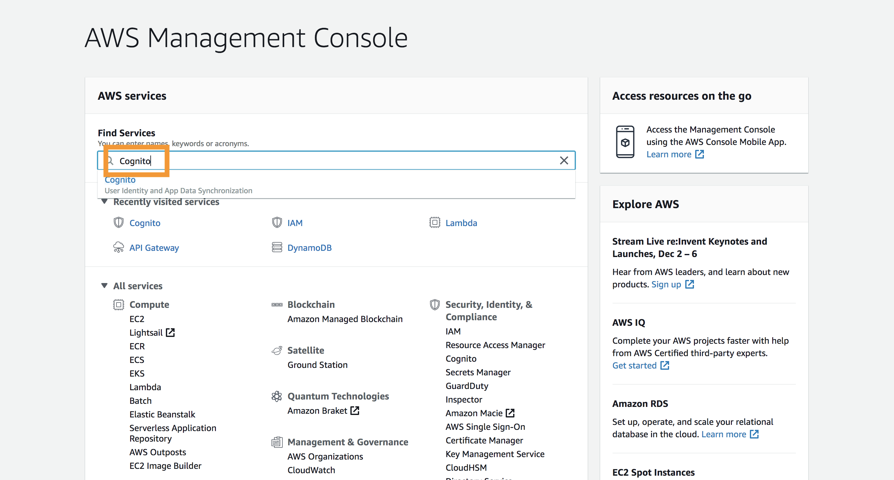

1. Select `Manage User Pools` and click on the dce user pool.

    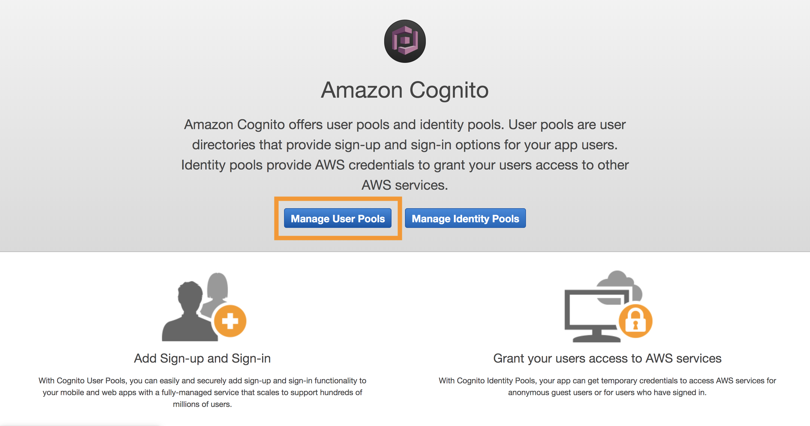

1. Select `Users and groups`

    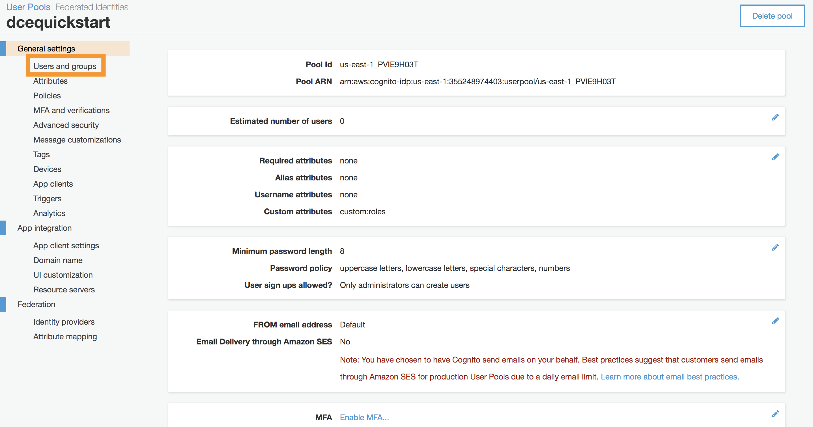
    
1. Create a user

    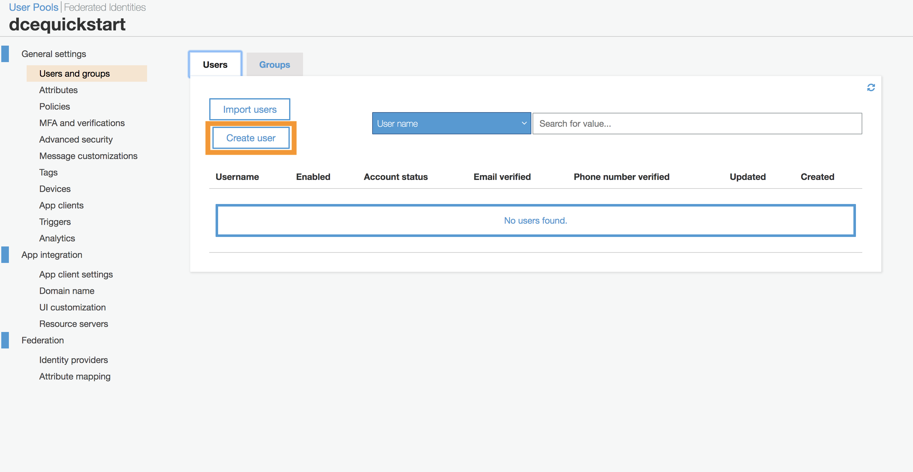

1. Name the user and provide a temporary password. You may uncheck all of the boxes and leave the other fields blank. This user will not have admin priviliges.

    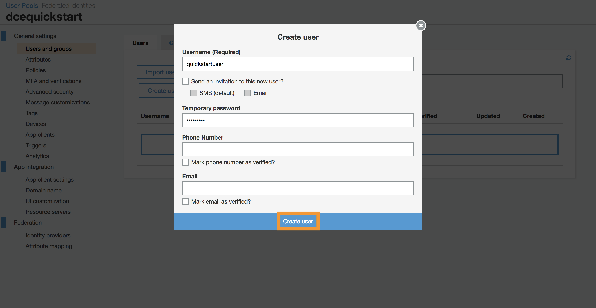
    
1. Create a second user to serve as a system admin. Follow the same steps as you did for creating the first user, but name this one something appropriate for their role as an administrator.
   
    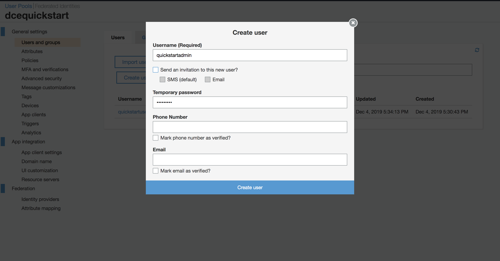

1. Create a group

    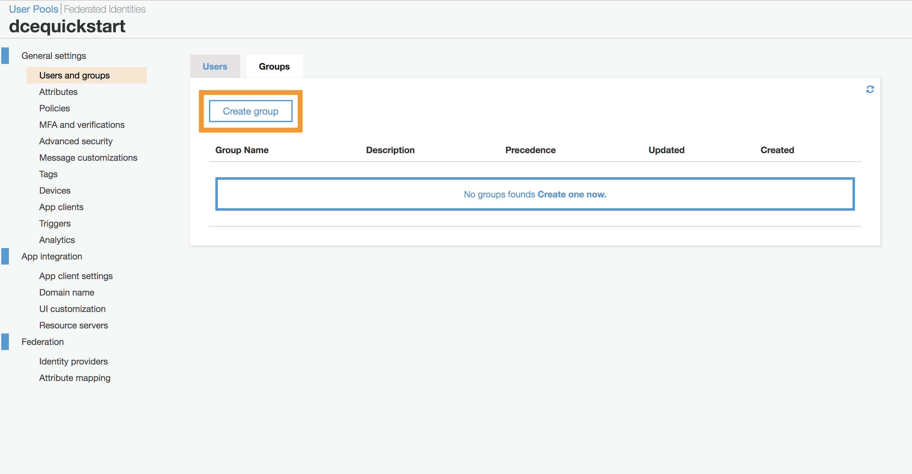

1. Users in this group will be granted admin access to DCE. The group name must contain the term `Admin`. Choose a name and click on the `Create group` button.

    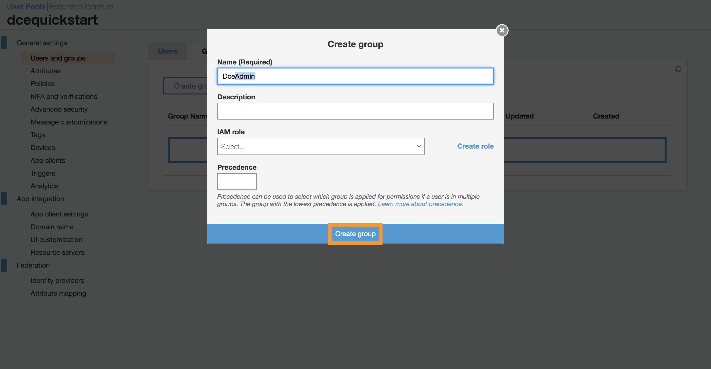
    
1. Add your admin user to the admin group to grant them admin privileges. 
    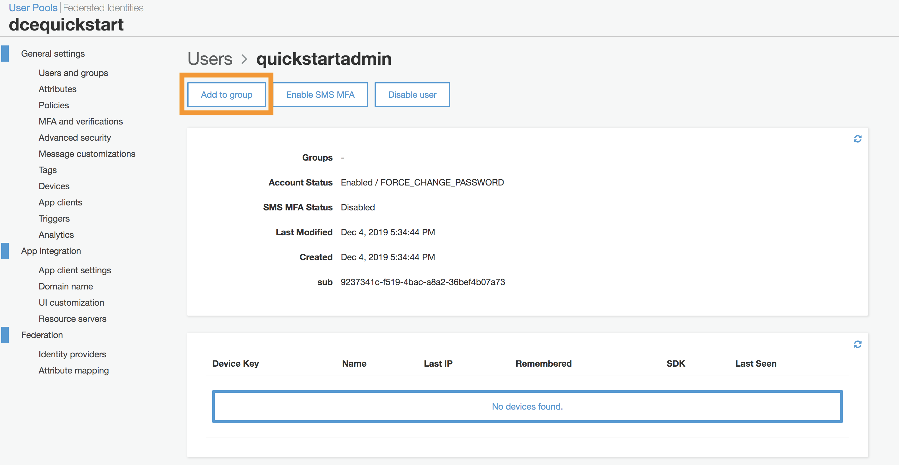
    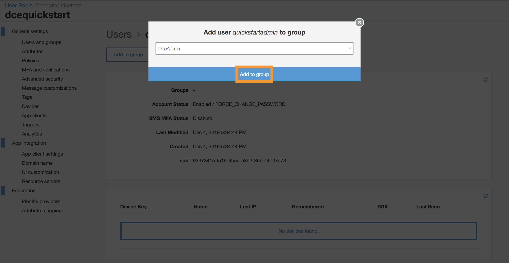

1. Type `dce auth` in your command terminal. This will open a browser with a log in screen. Enter the username and password for the non-admin user that you created. Reset the password as prompted.

    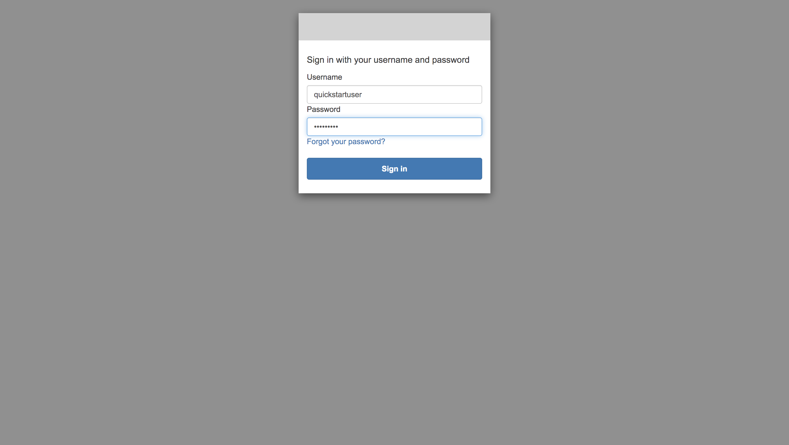

1. Upon successfully logging in, you will be redirected to a credentials page containing a temporary authentication code. Click the button to copy the auth code to your clipboard.
   
    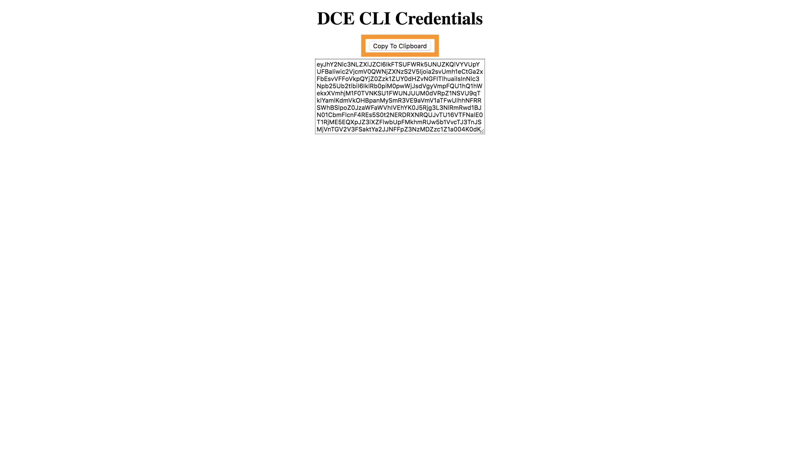
    
1. Return to your command terminal and paste the auth code into the prompt, then press enter.
    
    ```
    dce auth
    ✔ Enter API Token: : █ 
    ```

1. You are now authenticated as a DCE User. Test that you have proper authorization by typing `dce leases list`.
This will return an empty list indicating that there are currently no leases which you can view. 
If you are not properly authenticated as a user, you will see a permissions error.

    ```
    dce leases list
    []
    ```
   
1. Users are not authorized to list child accounts in the accounts pool. Type `dce accounts list` to verify that you get a permissions error when trying to
view information you do not have access to.

    ```
    dce accounts list
    err:  [GET /accounts][403] getAccountsForbidden
    ```

1. You will need to be authenticated as an admin before continuing to the next section. Type `dce auth` to log in as a different user. Sign out, then enter the username
and password for the admin that you created. As before, copy the auth code and paste it in the prompt in your command terminal.

    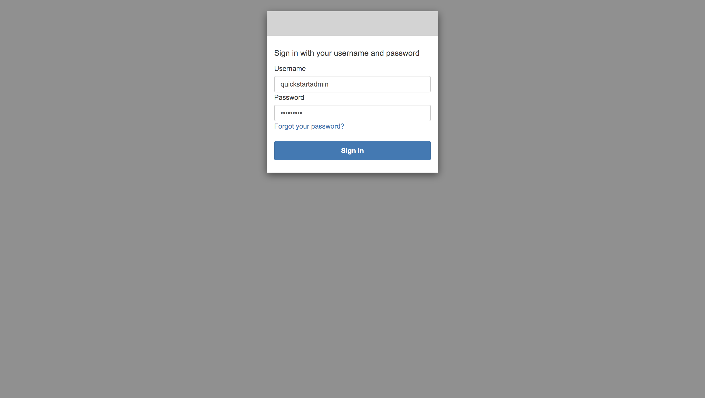
    
1. Test that you have admin authorization by typing `dce accounts list`. You should see an empty list now instead of a permissions error.
   
    ```
    dce accounts list
    []
    ```

## Adding a child account

1. Prepare a second AWS account to be your first "DCE Child Account".
    - Create an IAM role with `AdministratorAccess` and a trust relationship to your DCE Master Accounts
    - Create an account alias by clicking the 'customize' link in the IAM dashboard of the child account. This must not include the terms "prod" or "production".

1. Use the `dce accounts add` command to add your child account to the "DCE Accounts Pool".

    *WARNING: This will delete any resources in the account.*

    ```
    dce accounts add --account-id 555555555555 --admin-role-arn arn:aws:iam::555555555555:role/DCEMasterAccess
    ```

1. Type `dce accounts list` to verify that your account has been added.

    ```
    dce accounts list
    [
        {
            "accountStatus": "NotReady",
            "adminRoleArn": "arn:aws:iam::555555555555:role/DCEMasterAccess",
            "createdOn": 1575485630,
            "id": "775788068104",
            "lastModifiedOn": 1575485630,
            "principalPolicyHash": "\"bc5872b50475b186afea67ff47516a8f\"",
            "principalRoleArn": "arn:aws:iam::775788768154:role/DCEPrincipal-quickstart"
        }
    ]
    ```
    The account status will initially say `NotReady`. It may take up to 5 minutes for the new account to be processed. Once the account status is `Ready`, you may proceed with creating a lease.

## Leasing a DCE Account

1. Use the `dce auth` command to authenticate as a non-admin user.

1. Now that your accounts pool isn't empty, you can create your first lease using the `dce leases create` command.

    ```
    dce leases create --budget-amount 100.0 --budget-currency USD --email jane.doe@email.com --principal-id jdoe99
    Lease created: {
        "accountId": "555555555555",
        "budgetAmount": 100,
        "budgetCurrency": "USD",
        "budgetNotificationEmails": [
            "jane.doe@email.com"
        ],
        "createdOn": 1575490207,
        "expiresOn": 1576095007,
        "id": "e501cb86-8317-458b-bdce-d47ab92f86a8",
        "lastModifiedOn": 1575490207,
        "leaseStatus": "Active",
        "leaseStatusModifiedOn": 1575490207,
        "leaseStatusReason": "Active",
        "principalId": "jdoe99"
    }
    ```
   
1. Type `dce leases list` to verify that a lease has been created

    ```
    dce leases list
   [
   	{
   		"accountId": "555555555555",
   		"budgetAmount": 100,
   		"budgetCurrency": "USD",
   		"budgetNotificationEmails": [
   			"jane.doe@email.com"
   		],
   		"createdOn": 1575490207,
   		"expiresOn": 1576095007,
   		"id": "e501cb86-8317-458b-bdce-d47ab92f86a8",
   		"lastModifiedOn": 1575490207,
   		"leaseStatus": "Active",
   		"leaseStatusModifiedOn": 1575490207,
   		"leaseStatusReason": "Active",
   		"principalId": "jdoe99"
   	}
   ]
    ```

1. If we try to login to this leased account, we will receive a permissions error since it is registered under a different user (i.e. `jdoe99` != `quickstartuser`).

    ```
     dce leases login -c e501cb86-8317-458b-bdce-d47ab92f86a8
    err:  [POST /leases/{id}/auth][403] postLeasesIdAuthForbidden
    ```

1. End the current lease and create one with a principalId matching your username (`quickstartuser`). NOTE: Used accounts are placed in NotReady status while they are prepared for a new lease. You will need to wait several minutes before creating a new lease if this is the only account in your accounts pool.

    ```
    dce leases end --account-id 555555555555 --principal-id jdoe99
    ```
       
    ```
    dce leases create --budget-amount 100.0 --budget-currency USD --email jane.doe@email.com --principal-id quickstartuser
   Lease created: {
   	"accountId": "948334904178",
   	"budgetAmount": 100,
   	"budgetCurrency": "USD",
   	"budgetNotificationEmails": [
   		"jane.doe@email.com"
   	],
   	"createdOn": 1575509206,
   	"expiresOn": 1576114006,
   	"id": "19a742a0-149f-41e5-813a-6d3be101058b",
   	"lastModifiedOn": 1575509206,
   	"leaseStatus": "Active",
   	"leaseStatusModifiedOn": 1575509206,
   	"leaseStatusReason": "Active",
   	"principalId": "quickstartuser"
   }
   ```
   We can log in to this lease because our username (`quickstartuser`) matches the lease's principalId.
   
   ```
    dce leases login -c 19a742a0-149f-41e5-813a-6d3be101058b
   export AWS_ACCESS_KEY_ID=xxxxxMAJKITACBQZURXH
   export AWS_SECRET_ACCESS_KEY=xxxxxqr6c/S27StiD5OjZSjl0u3UAzuOREe+9Z/D
   export AWS_SESSION_TOKEN=xxxxxXIvYXdzECwaDGtnz7u+ob+S0oymzCKyAb0oyNJJnrDZIG3ZzBiBh2P4oFB9ST3OATogyo4ynFQE9mtcms2ITP6hXK3p30wK/kE/VfSLKG77FP++7qjNYhnWlIfvnntYoMHQvjHEmiLZ8oqXEmlJDhhDoyBUFSBZ4nqbklwnvZSSoA8mIA2ey7ZCau+KvJJxqjif4DSgLxgNQETuxHp2zJcnfVQB+0QBk7yCiNbFklqk/aM4jBxMV0K+/xeV+YOF4K+dyAZCWZL3wPko76il7wUyLSvuRc+bVk4rob3CiR9vWO7bbZokX/zRDNH1o2+ktuFXzpApumEEgaXGYgnCxQ==
   ```


## Logging into a leased account

There are three ways to "log in" to a leased account.

1. To use the *AWS CLI* with your leased account, type `dce leases login <lease-id>`. The `default` profile will be used unless you specify a different one with the `--profile` flag. 

    ```
    dce leases login --profile quickstart 19a742a0-149f-41e5-813a-6d3be101058b
    Adding credentials to .aws/credentials using AWS CLI
    cat ~/.aws/credentials
    [default]
    aws_access_key_id = xxxxxxxxxxxxxxxxxxxx
    aws_secret_access_key = xxxxxxxxxxxxxxxxxxxxxxxxxxxxxxxxxxxxxxxx
    
    [quickstart]
    aws_access_key_id = xxxxxMAJKITANQZPFFXY
    aws_secret_access_key = xxxxxDEiaAvZ0OeqO5qxNBcJVrFGzNLxz6tgKWTF
    aws_session_token = xxxxxXIvYXdzEC0aDFEgMqpsBg4dtUS1qSKyAa3ktoh0SBPbwJv3S5B5NXdG8OdOVCQsya5b943mFfJnxX2reFw1a/r+LKa7G6CKj2NnWbkVWXdzWEVtsjy5Y32po2kVDp1lt74C7V6H8xbOk4HjgiXLOQl5faXpjmi80yaFI/yBrvnBbQVOq9QkbpeHcSyEkoouSkagCtkPicjLjq6omrAGR2xDXrrFYvYRIMevj2mZoBkk/5jGB3FpNycuWz6weqF4Z6qlCZLSalfetEAow7ml7wUyLf4OrtDvPgTPBjg6PClxC6BZgUMZaQM9ePQR0ZgMynNvm7JHbQz38jLCBqzneQ==
    ```
   
1. Access your leased account in a *web browser* via the `dce leases login` command with the `--open-browser` flag

    ```
    dce leases login --open-browser 19a742a0-149f-41e5-813a-6d3be101058b
    Opening AWS Console in Web Browser
    ```

1. To *print your credentials*, type `dce leases login` command with the `--print-creds` flag

    ```
    dce leases login --print-creds 19a742a0-149f-41e5-813a-6d3be101058b
    export AWS_ACCESS_KEY_ID=xxxxxMAJKITANQZPFFXY
    export AWS_SECRET_ACCESS_KEY=xxxxxDEiaAvZ0OeqO5qxNBcJVrFGzNLxz6tgKWTF
    export AWS_SESSION_TOKEN=xxxxxXIvYXdzEC0aDFEgMqpsBg4dtUS1qSKyAa3ktoh0SBPbwJv3S5B5NXdG8OdOVCQsya5b943mFfJnxX2reFw1a/r+LKa7G6CKj2NnWbkVWXdzWEVtsjy5Y32po2kVDp1lt74C7V6H8xbOk4HjgiXLOQl5faXpjmi80yaFI/yBrvnBbQVOq9QkbpeHcSyEkoouSkagCtkPicjLjq6omrAGR2xDXrrFYvYRIMevj2mZoBkk/5jGB3FpNycuWz6weqF4Z6qlCZLSalfetEAow7ml7wUyLf4OrtDvPgTPBjg6PClxC6BZgUMZaQM9ePQR0ZgMynNvm7JHbQz38jLCBqzneQ==
    ```
 
## Removing a Child Account

1. Use the `dce auth` command to authenticate as an admin

1. You can remove an account from the accounts pool using the `dce accounts remove` command

    ```
    dce accounts remove 555555555555
    ```